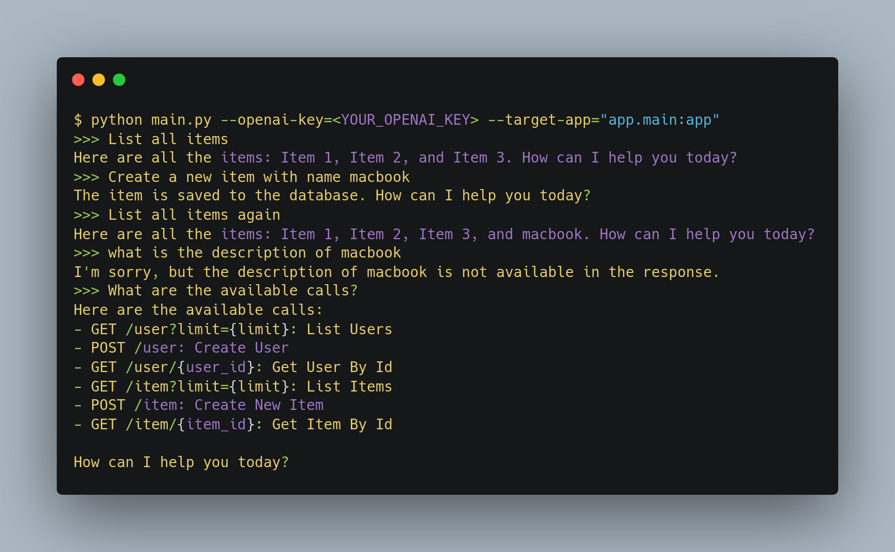
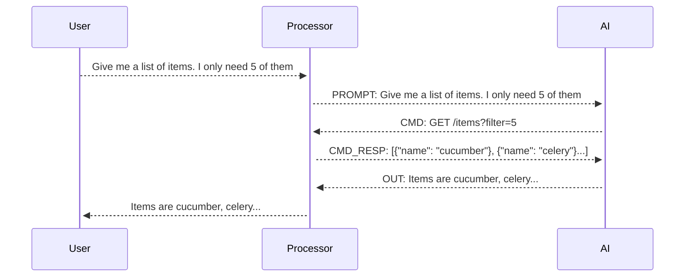

# API Doc GPT

This is an AI tool that helps you discover your API documentation. It is based on the [GPT-3.5](https://openai.com/blog/better-language-models/) language model from OpenAI.
You can use this with either directly connecting to a FastApi app or by passing in an `openapi.json` file.

## Setup

Install the dependencies

```bash
pip install -r requirements.txt
```

## How to use with FastApi

1. Run your backend app

```bash
uvicorn main:app --reload
```

2. Run the script

```bash
python api_master.py --openai-key <your-openai-key> --target <your-fastapi-app> --base-url <your-base-url>
```

## How to use with openapi.json

```bash
python api_master.py --openai-key <your-openai-key> --openapi-json <openapi-json> --base-url <your-base-url>
```

## Running example

```bash
python api_master.py --openai-key=<your-openai-key> --openapi-json=../openapi3.json --base-url="https://petstore3.swagger.io/api/v3"
```

Enjoy interacting with your API documentation


# With GPT-4

This also works with GPT-4. You just need to pass parameter `--model-name=gpt-4` while running the script.

## How it works

This works by creating open api documentation from your fastapi app and then using the GPT-3.5 language model to analyze documentation for your API.



## Constraints

- Token size
