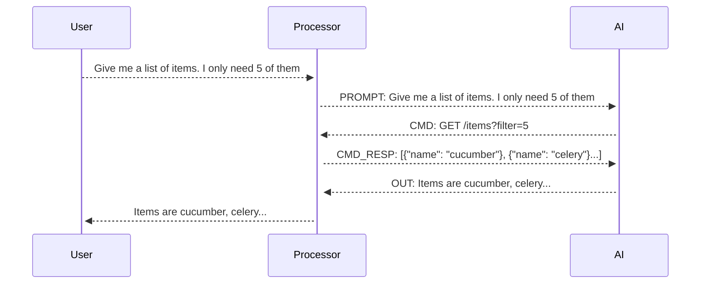

# API Doc GPT

This is an AI tool that helps you discover your API documentation. It is based on the [GPT-3.5](https://openai.com/blog/better-language-models/) language model from OpenAI.
As of now, this only works with FastAPI taking advantage of its OpenAPI Generator.

## How to use

1. Install the dependencies

```bash
pip install -r requirements.txt
```

2. Run your backend app

```bash
uvicorn main:app --reload
```

3. Run the script

```bash
python main.py --openai-key <your-openai-key> --target <your-fastapi-app> --base-url <your-base-url>
```

4. Enjoy interacting with your API documentation
   

## How it works

This works by creating open api documentation from your fastapi app and then using the GPT-3.5 language model to analyze documentation for your API.



## Constraints

- This only works with FastAPI
- Authentication is not supported
- Not possible to configure headers
